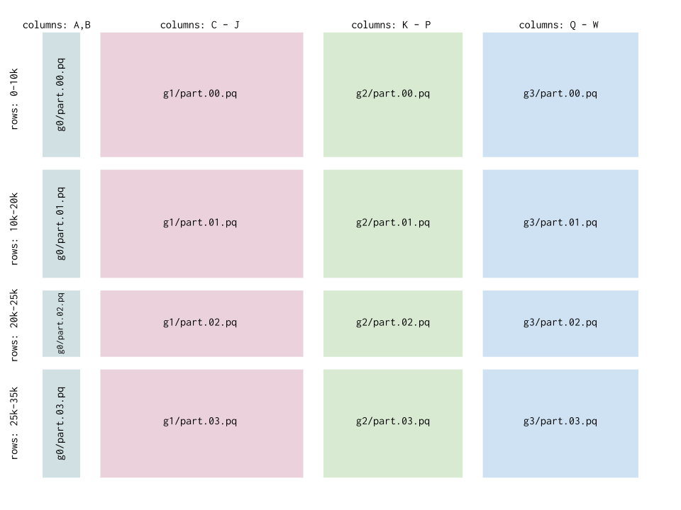

==========
Quickstart
==========

Layout
------

In the simplest case, you might want to read your data from a single file. This is pretty easy in
pandas, but blocks adds additional support for inferring file types and support cloud storage:

.. code-block:: python

    import pandas as pd
    import blocks
    df = blocks.assemble('data.pkl') # same as pd.read_pickle
    df = blocks.assemble('gs://mybucket/data.parquet')

Many projects need to combine data stored in  several files. To support this, blocks makes a few
assumptions about your data. You've split it up into blocks, either into groups of columns (cgroups)
or groups of rows (rgroups). You can read all this data into a single dataframe in memory with one
command:

.. code-block:: python

    import blocks
    blocks.assemble('data/')

If all of your files are in one directory, then the rows will be concatenated:

::

    data
    ├── part.00.pq
    ├── part.01.pq
    └── part.02.pq

If your files actually contain the same rows but store different columns, you should place them in different folders with corresponding names:

::

    data
    ├── g0
    │   └── part.00.pq
    ├── g1
    │   └── part.00.pq
    └── g2
        └── part.00.pq

In the most general case you can do both, laying out your data in multiple cgroups and rgroups - where each rgroup should contain the same
logical rows (e.g. different attributes of the same event)

::

    ─ data
      ├── g0
      │   ├── part.00.pq
      │   ├── part.01.pq
      │   ├── part.02.pq
      │   └── part.03.pq
      ├── g1
      │   ├── part.00.pq
      │   ├── part.01.pq
      │   ├── part.02.pq
      │   └── part.03.pq
      ├── g2
      │   ├── part.00.pq
      │   ├── part.01.pq
      │   ├── part.02.pq
      │   └── part.03.pq
      └── g3
          ├── part.00.pq
          ├── part.01.pq
          ├── part.02.pq
          └── part.03.pq

This corresponds to the following dataframe structure:

This pattern generalizes very well when you start collecting data from multiple sources and with enough content that the
entire dataset won't comfortably fit into memory at once.

Blocks supports multiple data formats, including ``csv``, ``hdf5``, ``pickle``, and ``parquet``. Reads from these files
are handled by ``pandas`` libraries, so they support all of the options you expect like headers, index columns, etc.
All of the ``blocks`` interfaces below support passing keyword args to the read functions for the files (see the docstrings).
The files can be local (referenced by normal paths) or on GCS (referenced by paths like ``gs://bucket``).

**Note that rgroups are combined by simple concatenation, and cgroups are combined by a "natural left join":
any shared columns are considered join keys.**  Key-based merging only makes sense with named columns, so make sure
any CSVs you use have a column header if you want to join cgroups.

Read
----

Assemble
========

Assemble is the primary data reading command, and can handle any of the layouts above. You can select subsets of the data
using glob patterns or the ``cgroups`` and ``rgroups`` arguments:

=======================  =====================================================================
Layout                   Recipe
=======================  =====================================================================
.. image:: both.png      .. code-block:: python

                             blocks.assemble('data/')

.. image:: column.png    .. code-block:: python

                             blocks.assemble('data/g1/*')
                             # or
                             blocks.assemble('data/', cgroups=['g1'])

.. image:: row.png       .. code-block:: python

                             blocks.assemble('data/*/part.01.pq')
                             # or
                             blocks.assemble('data/', rgroups=['part.01.pq'])

.. image:: filtered.png  .. code-block:: python

                             blocks.assemble('data/*/part.01.pq', cgroups=['g0', 'g1', 'g3'])
                             # or
                             blocks.assemble(
                                 'data/',
                                 rgroups=['part.01.pq'],
                                 cgroups=['g0', 'g1', 'g3']
                             )

=======================  =====================================================================

Iterate
=======

Blocks also has an iterative option for performing operations on each of the blocks without loading them all
into memory at once:

.. code-block:: python

    import blocks

    for cgroup, rgroup, df in blocks.iterate('data/'):
        print(df.shape)

``iterate`` supports the same syntax and features as ``assemble`` above, but instead of returning a merged dataframe,
it returns an iterator of ``(rgroup, cgroup, dataframe)`` where the ``rgroup`` and ``cgroup`` are the names of the
groups (``'g0'`` and ``'part.00.pq'`` from above).

``iterate`` can also operate on multiple axes - the default is to iterate over every block separately. But if you
specify ``axis=0``, then iterate will combine cgroups and iterate over rgroups, and for ``axis=1`` it will iterate
over the cgroups while combining any rgroups.

==========================  =====================================================================
Direction                   Recipe
==========================  =====================================================================
.. image:: row_iter.png     .. code-block:: python

                                # iterate over one dataframe per rgroup
                                for rgroup, df in  blocks.iterate('gs://path/to/data', axis=0):
                                    print(df.shape)
.. image:: column_iter.png  .. code-block:: python

                                # iterate over one dataframe per cgroup
                                for cgroup, df in  blocks.iterate('gs://path/to/data', axis=1):
                                    print(df.shape)
==========================  =====================================================================

Partitioned
===========

Dask_ provides a great interface to a partitioned dataframe, and you can use blocks' simple syntax to
build a ``dask.dataframe``. Checkout the dask documentation for details on how to use the resulting object.

.. code-block:: python

    import blocks

    # need to have separately installed dask
    dask_df = blocks.partitioned('data/*/part_0[1-4].pq')

    dask_df.groupby('category').mean().compute()

Write
-----

Place
=====

If you want to put a dataframe into a single file, use ``place``:

.. code-block:: python

    import blocks

    blocks.place(df, 'data/part_00.pq')
    blocks.place(df, 'gs://mybucket/data/part_00.pq')

Like with ``assemble`` for a single file, this is easy in ``pandas``, but ``blocks`` infers the file
type and has support for cloud storage.

Divide
======

For paritioning your data, blocks also has a divide function. You'd use this to split up a single large dataframe
in memory into many rgroups and/or cgroups on disk, to help with parallelizing analysis. By default the blocks are
written as ``parquet`` files, but you can specify other extensions including ``.hdf5``, ``.csv``, and ``.pkl``.

.. code-block:: python

    import blocks

    # divide into just row groups
    blocks.divide(df, 'data/', n_rgroup=3)

::

    data
    ├── part_00.pq
    ├── part_01.pq
    └── part_02.pq

Divide can also handle column groups:

.. code-block:: python

    # split into 10 rgroups and specific cgroups
    cgroup_columns = {
        'g0': ['id', 'timestamp', 'metadata'],
        'g1': ['id', 'timestamp', 'feature0', 'feature1'],
        'g2': ['id', 'timestamp', 'feature2', 'feature3'],
        'g3': ['id', 'timestamp', 'feature4', 'feature5', 'feature6'],
    }
    blocks.divide(df, 'data/', 4, cgroup_columns=cgroup_columns)

::

    ─ data
      ├── g0
      │   ├── part.00.pq
      │   ├── part.01.pq
      │   ├── part.02.pq
      │   └── part.03.pq
      ├── g1
      │   ├── part.00.pq
      │   ├── part.01.pq
      │   ├── part.02.pq
      │   └── part.03.pq
      ├── g2
      │   ├── part.00.pq
      │   ├── part.01.pq
      │   ├── part.02.pq
      │   └── part.03.pq
      └── g3
          ├── part.00.pq
          ├── part.01.pq
          ├── part.02.pq
          └── part.03.pq

.. _Dask: http://dask.pydata.org/en/latest/
